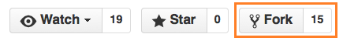
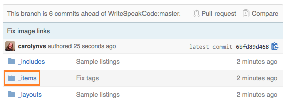
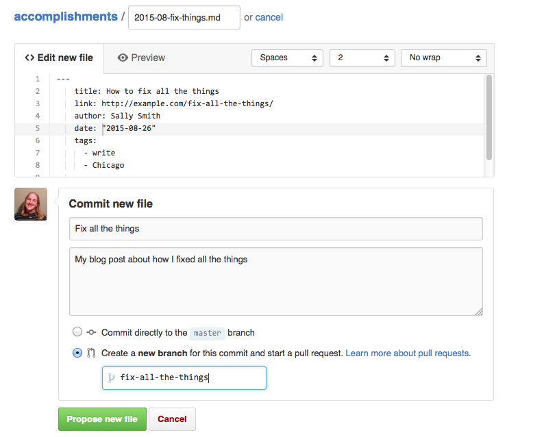

## Share your Write/Speak/Code accomplishments!

Did you write a blog post at a work night meetup? Were you inspired to
submit a lightning talk at a conference? Submit a PR to an open-source repository?

Let everyone know by submitting a pull request to this repository.

1. Go to our [GitHub repository][repo] in your web browser.

2. Fork the repository.

    

3. In your fork on GitHub, click on the **\_items** directory. This directory contains
    a file for for every accomplishment.

    

4. Click the **+** icon to create an entry for your accomplishment.

    

5. Name the new file, **YYYY-MM-title.md**. For example, `2015-09-devops-days-newbie.md`.

6. Populate the file contents using the following templates:

    **write**

    ```yaml
    ---
    title: Your blog post title, e.g. How to fix all the things
    link: link to your blog post, e.g. http://example.com/fix-all-the-things/
    author: Your Name, e.g. Sally Smith
    date: Your blog post's publish date, in double quotes, e.g. "2015-08-26"
    tags:
      - write
      - Your Write/Speak/Code chapter, e.g. Chicago, New York or San Francisco
    ---
    ```

    **speak**

    ```yaml
    ---
    title: Your talk title, e.g. How to fix all the things
    link: link to your talk, e.g. http://example.com/fix-all-the-things/
    author: Your Name, e.g. Sally Smith
    venue: The conference name, e.g. DevOps Days
    date: Your talk's date, in double quotes, e.g. "2015-08-26"
    tags:
      - speak
      - Your Write/Speak/Code chapter, e.g. Chicago, New York or San Francisco
    ---
    ```

    **code**

    ```yaml
    ---
    title: Your pull request title, e.g. I fixed all the things
    link: link to your talk, e.g. http://github.com/example/example/pull/1
    author: Your Name, e.g. Sally Smith
    project: The project name to which you contributed
    date: The date you submitted the pull request, in double quotes, e.g. "2015-08-26"
    tags:
      - code
      - Your Write/Speak/Code chapter, e.g. Chicago, New York or San Francisco
    ---
    ```

7. Optionally set a commit title.
8. Select **Create a new branch for this commit and start a pull request**.
9. Click the **Propose new file** button to submit the pull request.



We will review your pull request, working with you to address any problems.
Once it is merged, it will appear on the accomplishments home page.

[repo]: https://github.com/WriteSpeakCode/accomplishments
